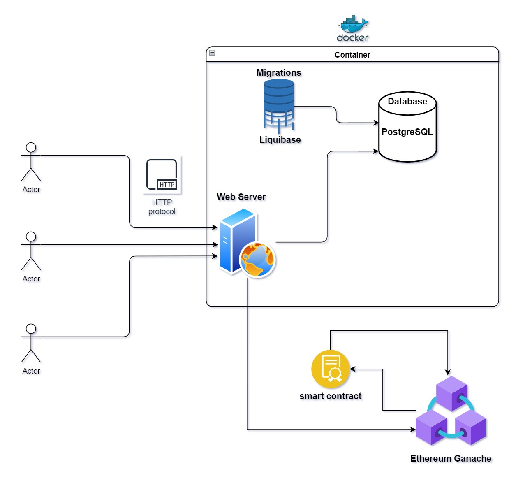

# P2P insurance

Веб-сервис для p2p страхования с использованием блокчейн платформы Ethereum

# Архитектура приложения



# Запуск приложения
В качестве тестовой сети используется Ganache запущенный локально.

Алтернативный вариант: 

Можно использовать закомментированный контейнер в ```compose.yaml```,
в его логах будет необходимая информация об аккаунтах,
подключаться к аккаунтам можно через расширение браузера ```Metamask```

---

Необходимо создать файл ```.env``` в корне проекта
и внетси необходимую информацию. 

В проекте есть пример в файле ```.env.example```

---

Компиляция и запуск приложения:

```bash
$ ./mvnw clean package
$ docker compose up --build -d 
```

---

По адрессу http://localhost:8080/swagger-ui доступно API приложения, автоматически сгенерированное через OpenAPI


Порт зависит от конфигурации в ```.env```

---

Примеры запросов есть в ```resources/requests```
